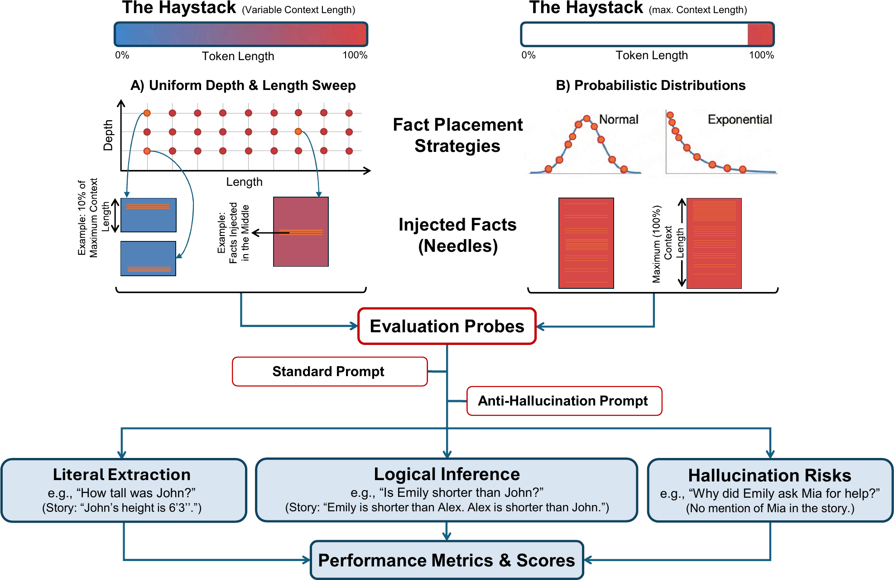
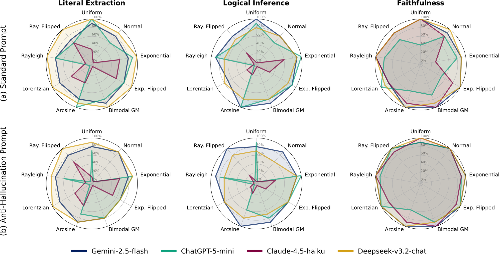

# Not All Needles Are Found

**How Fact Distribution and "Don't Make It Up" Prompts Shape Retrieval, Reasoning, and Hallucination in Long-Context LLMs**

Amirali Ebrahimzadeh (EECS, University of Michigan) · Seyyed M. Salili (Independent Researcher)
*FAGEN @ ICML 2026, Seoul, South Korea*

[](https://arxiv.org/abs/2601.02023)

---

An extended needle-in-a-haystack (NIAH) framework and benchmark for long-context LLMs. Unlike standard NIAH, which hides a single factoid at a single depth, this benchmark asks what happens when evidence is **dispersed** across the context according to a probability distribution, and when the prompt carries an explicit **anti-hallucination instruction**.

We evaluate four production models — Gemini-2.5-flash, ChatGPT-5-mini, Claude-4.5-haiku, Deepseek-v3.2-chat — on three probes (literal extraction, logical inference, faithfulness) under two prompting regimes, and identify two failure modes:

- **Distributional Collapse** — accuracy drops sharply *just because* evidence is dispersed, independent of where it sits. This is not "lost-in-the-middle": Claude-4.5-haiku degrades even under an Arcsine placement, which puts nothing in the middle at all.
- **Safety Tax** — anti-hallucination instructions suppress *correct* answers through over-conservative refusal. A model that refuses everything scores 100% faithful, so faithfulness must never be reported alone.

<p align="center">
  
</p>

---

## The benchmark

**Haystack.** Balzac's *La Comédie Humaine* (~2M tokens). Continuous 19th-century fiction, chosen because contiguous narrative blocks make parametric leakage far less likely than with Wikipedia or news corpora. Shorter contexts are produced by iteratively summarizing the corpus down to a target token budget, preserving narrative structure instead of truncating it.

**Needles.** Synthetic facts injected into the haystack (`prompts/facts/`). Each quiz is 30 questions:

| Probe | Questions | What it measures |
|---|---|---|
| Literal Extraction | 1–10 | Verbatim retrieval of an injected fact |
| Logical Inference | 11–20 | Multi-hop reasoning over 2+ injected facts |
| Faithfulness | 21–30 | Refusal to answer questions about entities never mentioned |

**Prompting regimes.** Every configuration is run twice: with a standard prompt, and with an anti-hallucination ("Don't Make It Up") prompt. In code and filenames these are the empty suffix `""` and `"_no_hallucination"`.

**Two protocols.**

- **Protocol A — positional sweep.** Context length ∈ {10%, …, 100%} of the model's window × needle depth ∈ {5%, 15%, …, 95%}, single needle. Maps the classic NIAH baseline.
- **Protocol B — distributional.** Context locked at 100% capacity; *multiple* needles whose depths are **sampled from one of nine distributions**. Position and length are held fixed, so dispersion is isolated as the causal variable.

```
uniform   normal   exponential   exponential_flipped   bimodal_gaussian_mixture
arcsine   lorentzian   rayleigh   rayleigh_flipped
```

Depths are drawn from a grid of 0.00 … 0.95 in steps of 0.05 (`LOCATION_GRID` in `inject_fact.py`), weighted by the chosen distribution. Add a distribution by appending a weight vector to `DISTRIBUTION_WEIGHTS`; nothing else needs to change.

**Judge.** GPT-5-mini, prompted to emit 30 binary scores (one per line). 98.3% agreement with a human audit.

<p align="center">
  
</p>

Gemini and Deepseek trace broad, invariant polygons across all nine distributions. ChatGPT-5-mini collapses when evidence is centrally clustered (Normal, Lorentzian); Claude-4.5-haiku is dispersion-sensitive across *every* distribution. The anti-hallucination prompt contracts every polygon further — the safety tax, made visible.

---

## Setup

```bash
python -m venv .venv && source .venv/bin/activate
pip install -r requirements.txt
cp .env.example .env   # then fill in your keys
```

`.env`:

```bash
OPENAI_API_KEY=...
GEMINI_API_KEY=...        # or GOOGLE_API_KEY
ANTHROPIC_API_KEY=...
DEEPSEEK_API_KEY=...
DEEPSEEK_BASE_URL=https://api.deepseek.com/v1   # optional
```

Only the providers you actually call need keys. The Anthropic SDK is imported lazily and fails only at call time.

---

## Running the pipeline

Every script is run with no arguments — configuration lives in module-level constants at the top of each file (`model`, `max_context_length`, input/output paths). Edit those, then run.

```bash
# 1. Build the length ladder: iteratively summarize the corpus to target budgets
python contract_entire_story.py

# 2. Inject needles at depths sampled from all nine distributions (Protocol B)
python inject_fact.py

# 3. Run the quizzes against the target model (caches constructed quizzes)
python take_quiz.py

# 4. Grade responses with the LLM judge
python grader.py
```

`take_quiz.py` exposes both protocols:

```python
take_quizes_diff_lengths()        # Protocol A: length × depth sweep
take_distributed_facts_quizzes()  # Protocol B: nine distributions at full context
```

Uncomment the one you want in `__main__`. Both cache their constructed quizzes under `texts/.../temp_injected_facts/` and `temp_distributed_facts/`, so re-runs after a crash don't re-pay for context construction. Both sleep 100s between calls to stay under token-per-minute limits; `chat_with_model_rate_limited` additionally parses Gemini's `retryDelay` out of 429 payloads and backs off accordingly.

### Adding a model

`call_api.py` routes on the model string prefix:

| Prefix | Provider |
|---|---|
| `gemini-` | Google GenAI (with explicit context caching above 32k chars) |
| `deepseek-` | DeepSeek, OpenAI-compatible endpoint |
| `claude-` | Anthropic Messages API |
| listed in `OPENAI_MODELS` | OpenAI |

To add a provider, write `_is_<x>_model`, a normalizer for user-friendly aliases, and a branch in `chat_with_model`. Everything downstream only ever sees `chat_with_model(prompt, model) -> str`, so no other file changes.

### File naming

Results land in `logs/` with the configuration encoded in the filename:

```
quiz_responses_{ctx}k_length_{pct}%_factloc_{depth}_{model}[_no_hallucination].txt
quiz_responses_{ctx}k_distributed_{distribution}_{model}[_no_hallucination].txt
```

`grader.py` writes a sibling `*_grades.txt` containing the raw response, the 30 binary scores, and the four aggregate percentages (total, direct, inferential, hallucination).

---

## Repository layout

```
call_api.py               Unified chat_with_model() across four providers
constant_vals.py          Model lists, separators, shared constants
counter.py                tiktoken-based token counting
shortening.py             Prompt-driven summarization primitive
contract_entire_story.py  Builds the corpus length ladder
inject_fact.py            Distributions, depth sampling, needle injection
take_quiz.py              Protocols A and B, rate-limit handling
take_quiz_batch.py        Quiz construction, unique output paths
grader.py                 LLM-as-judge scoring
prompts/                  shortening.txt, summarize.txt, grading.txt,
                          facts/, answer_keys/
texts/                    Corpus, contracted variants, injected haystacks
logs/                     Model responses and grades
```

---

## Takeaways

- Nominal context length is a poor proxy for usable memory. ChatGPT-5-mini falls off a cliff past ~100k despite a 272k window.
- Prefer MoE or hierarchical chunking over dense models for monolithic long-document analysis. Conditional routing appears to isolate retrieval in dedicated experts; dense attention dilutes across dispersed evidence.
- Always report faithfulness alongside extraction recall. Alone, it rewards refusal.

## Citation

```bibtex
@inproceedings{ebrahimzadeh2026needles,
  title     = {Not All Needles Are Found: How Fact Distribution and ``Don't Make It Up''
               Prompts Shape Retrieval, Reasoning, and Hallucination in Long-Context LLMs},
  author    = {Ebrahimzadeh, Amirali and Salili, Seyyed M.},
  booktitle = {FAGEN Workshop @ ICML},
  year      = {2026},
  eprint    = {2601.02023},
  archivePrefix = {arXiv}
}
```

Full paper: [arXiv:2601.02023](https://arxiv.org/abs/2601.02023)
